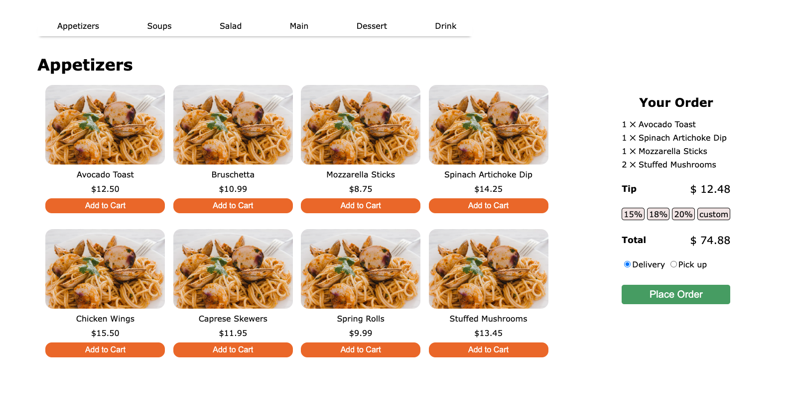

# Ordering Web App

This project is a part of the coursework at George Brown College in the first year of the program. It was completed as an exercise where two students exchanged the order of a random web page of an imaginary website that can be built within an hour or two. This exercise is referred to as the "Swap and Solve" exercise.

## Features

This web application provides a simple interface for users to select and add food items to their cart, calculate the total cost of their order, and include tips if desired. It demonstrates basic functionalities using HTML, CSS, and JavaScript.

- Allows users to add food items to the cart to place an order.
- Calculates the total sum of the order.
- Includes a feature to add tips to the order.

## Technologies Used

- HTML
- CSS
- JavaScript (included as an internal JS file in the HTML)

## Related Projects

I have previously built a similar concept console application using C# and .NET, which is stored in a separate repository. [Click here to visit the C# repo](https://github.com/jclairelee/OrderManagement)

## How to Run

1. Clone the repository.
2. Open the `index.html` file in a web browser.
